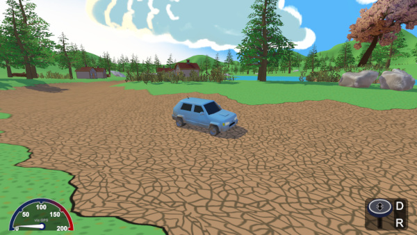
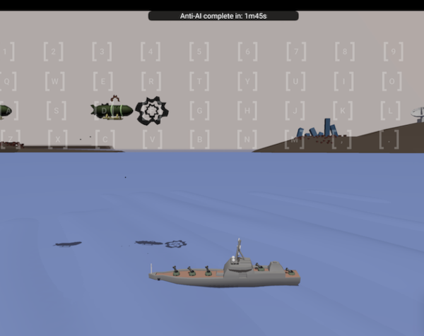
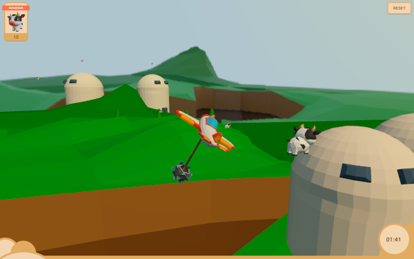

# Lacking Game Engine

A 3D game engine / framework that lacks a lot of features, hence the name.

**WARNING** This project is still not stable. I am playing around with the code a lot and trying stuff. Avoid using it if you are looking for something serious and reliable.

As I am quickly iterating over the code and making breaking changes all the time, avoid opening Pull Requests. The best you can do, if you want to contribute, is to open an Issue. Similarly, if you plan to use it for your own project, make sure to use a stable tag and be ready to face the consequences.

## Getting Started

To get a feel for how a game is structured and implemented using Lacking, have a look at the [source code](https://github.com/mokiat/rally-mka) of [Rally MKA](#rally-mka).

Otherwise, have a look at the official [web page](https://mokiat.com/lacking/) which contains information on how to set up a Hello World project.

## Examples

I have uploaded some example games made with this engine on `itch.io`.

### Rally MKA

Drive around in a car with no particular purpose except to zone out.
Best played with keyboard or mouse. The gamepad option is hard.

> This game was the initial reason for the lacking game engine.

### AI Suppression

A Game Jam entry. Use the keyboard to defend your ship from alien airships. Users of vim will have an easy time here.

> A solo 48h Sofia Game Jam (2023) entry.

### Dem Cows

Fly around in a plane and use a hanging club to pop cow balloons. As it uses semi-realistic physics it is best played with a gamepad and care should be taken regarding stall and speed. There wasn't enough time to balance this game. Winning it with keyboard is nearly impossible.

> A duo 48h Hardcore Game Jam (2024) entry.
