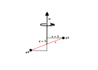

# Moment of Intertia

While mass represents the reluctance of an object to change its linear velocity, moment of inertia represents the reluctance of an object to change its angular momentum.
However, while having a lot of things in common, mass is much easier to reason about, whereas moment of inertia induces some strange properties on the motion of an object.
This is why this page is dedicated to discussing Moment of Inertia.

> NOTE: I have not studied physics past high school so more of the advanced stuff here is based on internet articles, tutorials, and personal reasoning. Take everything with a grain of salt.

The two main equations related to mass are as follows.

$$
\vec{p} = M \vec{v}
$$

and

$$
\vec{F} = M \vec{a}
$$

Where the second equation is derived by taking the derivative of the first one over time. In fact, it seems that Newton's second law of motion describes Force as the rate at which the momentum of an object changes with time.

For moment of inertia the equations are fairly similar.

$$
\vec{L} = I \vec{\omega}
$$

and

$$
\vec{\tau} = I \vec{\omega}
$$

Except that the second equation is actually wrong. While very common in a lot of text books, it works correctly only for 2D scenarios or in 3D scenarios where the rotation occurs over one of the principal axes (more on that later) of the object.

The correct equation is actually as follows.

$$
\vec{\tau} = I \vec{\alpha} + \vec{\omega} \times I \vec{\omega}
$$

In fact, similarly to the equation for force, this one is also derived by taking the derivative of the angular momentum equation (the first one) over time.

A key thing to note here is that unlike the force equation, where the mass is a scalar, in this equation the moment of inertia is actually a 3x3 matrix called a tensor. The reason for this is because the resistence to rotation differs depending on the angle of rotation. What's even more, the angular momentum or the torque (depending on which equation above is used) need not point in the same direction as the angular velocity or angular acceleration.

> NOTE: This last bit was hard for me to understand or create a mental image of. In the following text I will try to create a mostly intuitive explanation as to why the equation for torque is so complicated.

## The Intertia Tensor

We should first explore the Inertia Tensor $I$. As mentioned, it is a 3x3 matrix that is defined as follows.

$$
I =
\begin{bmatrix}
I_{xx} & I_{xy} & I_{xz} \\
I_{yx} & I_{yy} & I_{yz} \\
I_{zx} & I_{zy} & I_{zz} \\
\end{bmatrix}
$$

The components can be calculated as follows:

$$
I_{xx} = \sum_i{m_i (y_i^2 + z_i^2)}
$$

$$
I_{yy} = \sum_i{m_i (x_i^2 + z_i^2)}
$$

$$
I_{zz} = \sum_i{m_i (x_i^2 + y_i^2)}
$$

$$
I_{xy} = I_{yx} = - \sum_i{m_i x_i y_i}
$$

$$
I_{xz} = I_{zx} = - \sum_i{m_i x_i z_i}
$$

$$
I_{yz} = I_{zy} = - \sum_i{m_i y_i z_i}
$$

Where $m_i$ represents the mass of an individual particle of the object and $x_i$, $y_i$ and $z_i$ represent the location of the particle relative to the point of rotation.

One can use integration to solve the above equations for various shape types.

Check the [References](../references.md) page for links to resources with more detailed information on how this is derived.

So what is the difference between a tensor and a 3x3 matrix. Well, to my understanding, a tensor describes a transformation under a change of coordinates. It can produce a scalar, a vector, or more complicated outputs.

In the case of the moment of inertia, an input vector is transformed to an output vector and the transformation is linear, which is a tensor of second order and is described by a symmetric matrix.

The components $I_{xx}$, $I_{yy}$, and $I_{zz}$ are called _the moments of inertia_, whereas the other components, $I_{xy}$, $I_{yx}$, $I_{xz}$, $I_{zx}$, $I_{yz}$, and $I_{zy}$, are called _the products of inertia_.

> My understanding is that for any object, if you position the point of rotation to be the center of mass (which would be the common case for a physics engine), you can find three orthogonal axes, such that _the products of inertia_ are zero. In such cases, the axes are called principal axes and rotation over them does not induce any torque (i.e. we can the more simple $\vec{\tau} = I \vec{\alpha}$ equation). The moment of inertia becomes a diagonal matrix.

## The torque equation

So now that we know how the moment of inertia is calculated and represented, let's get back to the intimidating torque equation.

$$
\vec{\tau} = I \vec{\alpha} + \vec{\omega} \times I \vec{\omega}
$$

### Velocity-induced torque

Let us consider the second part of the equation.

$$
\vec{\omega} \times I \vec{\omega}
$$

It tells us that a torque can be induced by the angular velocity alone, even if there is no angular acceleration.

> NOTE: This torque does not appear if an object is rotated about one of its principal axes.

The best way to reason about this is to look at a very simplified and idealized version of a scenario where a torque is induced due to velocity. Let us explore the following setup.

We have an object comprised of two particles ($p_1$ and $p_2$), connected by a zero-mass rod (in red). The object is rotating with an angular velocity $\omega$.

Before diving into the moment inertia tensor and the equations from above, let us try to use high-school physics to evaluate what forces will act on the particles and if there is any torque actually induced.

If we look at point $p_1$, we can see that it is spinning with tangental velocity magninute of $x \omega$ (again, using high-school physics/math), which in our case is $2 \omega$.

Since there are no external forces (there is no angular acceleration on the object), the only force that the particle experiences is the one by the rod that is keeping it attached to the object. The opposite (but equal) force is actually the fictitious [Centrifugal force](https://en.wikipedia.org/wiki/Centrifugal_force).

That force is equal to the following.

$$
F_1 = mw^2r = mw^2x = 2mw^2
$$

This force induces a torque on the whole object.

$$
{\tau}_1 = rF_1 = yF_1 = 2mw^2
$$

We have the same thing occuring with $p_2$ as well. While the force has a negative sign, so does the torque radius ($r=-y=-1$) so we end up with the same torque. The total torque is the sum of the torques.

$$
\tau = {\tau}_1 + {\tau}_2 = 4mw^2
$$

The torque acts in a clockwise direction (if we were to use a vector, it would point inwards). If we think about it, it makes sense. The torque tries to level the two points to be on the same rotational plane.

This should give us some explanation to what the induced torque might be due to. Let's compare with the actual equations and see if they would produce the same.

Following is the calculation of the moment of inertia tensor.

$$
I_{xx} =
\sum_i{m_i (y_i^2 + z_i^2)} =
m (1^2 + 0^2) + m ((-1)^2 + 0^2) =
2m
$$

$$
I_{yy} =
\sum_i{m_i (x_i^2 + z_i^2)} =
m (2^2 + 0^2) + m ((-2)^2 + 0^2) =
8m
$$

$$
I_{zz} =
\sum_i{m_i (x_i^2 + y_i^2)} =
m (2^2 + 1^2) + m ((-2)^2 + (-1)^2) =
10m
$$

$$
I_{xy} = I_{yx} =
- \sum_i{m_i x_i y_i} =
- m(2)(1) -m(-2)(-1) =
- 4m
$$

$$
I_{xz} = I_{zx} =
- \sum_i{m_i x_i z_i} =
- m(2)(0) - m(-2)(0) =
0
$$

$$
I_{yz} = I_{zy} =
- \sum_i{m_i y_i z_i} =
- m(1)(0) - m(-1)(0) =
0
$$

Which leads to the following tensor matrix.

$$
I =
\begin{bmatrix}
2m & -4m & 0 \\
-4m & 8m & 0 \\
0 & 0 & 10m \\
\end{bmatrix}
=
2m
\begin{bmatrix}
1 & -2 & 0 \\
-2 & 4 & 0 \\
0 & 0 & 5 \\
\end{bmatrix}
$$

Next we can use it to calculate the torque.

$$
\vec{\tau} = \vec{\omega} \times I \vec{\omega} =
2m
\begin{bmatrix}
0 \\
\omega \\
0 \\
\end{bmatrix}
\times
\begin{bmatrix}
1 & -2 & 0 \\
-2 & 4 & 0 \\
0 & 0 & 5 \\
\end{bmatrix}
\begin{bmatrix}
0 \\
\omega \\
0 \\
\end{bmatrix}
$$

$$
\vec{\tau} =
2m
\begin{bmatrix}
0 \\
\omega \\
0 \\
\end{bmatrix}
\times
\begin{bmatrix}
-2 \omega \\
4 \omega \\
0 \\
\end{bmatrix} =
4m
\begin{bmatrix}
0 \\
\omega \\
0 \\
\end{bmatrix}
\times
\begin{bmatrix}
-1 \omega \\
2 \omega \\
0 \\
\end{bmatrix}
$$

Just the cross product is calculated as follows.

$$
\begin{bmatrix}
0 \\
\omega \\
0 \\
\end{bmatrix}
\times
\begin{bmatrix}
-1 \omega \\
2 \omega \\
0 \\
\end{bmatrix} =
\begin{bmatrix}
\omega (0) - 0(2\omega) \\
0 (-1\omega) - 0(0) \\
0(2\omega) - \omega(-1\omega) \\
\end{bmatrix} =
\begin{bmatrix}
0 \\
0 \\
{\omega}^2 \\
\end{bmatrix} =
$$

All of this produces the following result.

$$
\vec{\tau} =
4m
\begin{bmatrix}
0 \\
0 \\
{\omega}^2 \\
\end{bmatrix}
$$

This is a vector pointing inward that has a magnitude of $4m{\omega}^2$, just like we derived using the more basic math. What this means is that the centrifugal force must be the reason for the induced torque.

> NOTE: As previously stated, this is my personal reasoning for this and the math above seems to support it. Either way, there isn't much easy to read material out there on the matter, so this will have to do. End of the day, one should choose to use the official equations and should be fine. This is just an attempt to give some intuition and reasoning to those equations.

## Acceleration torque

If an object has an angular acceleration, then clearly it can apply torque to whatever is trying to resist it. According to the main equation above, we should be able to calculate that torque using the first part.

$$
\vec{\tau} = I\vec{\alpha}
$$

Let's have a look at our example setup again.

Before using the moment of inertia matrix to try and calculate that torque,
let's try and figure it out using more basic physics and math.

If we were to examine point $p_1$, we can reason that it must have a tangential acceleration, if the whole object has an angular acceleration. The tangential acceleration of the point can be calculated as follows.

$$
\vec{a_t} = \vec{\alpha} \times \vec{r}
$$

Looking at the diagrams and the vectors, we know that that acceleration points inward, so we can use the more basic equations to calculate the magnitude.

$$
a_t = \alpha x = 2 \alpha
$$

The force of that particle is then equal to the following.

$$
F_1 = 2 m \alpha
$$

Now that we have the particle's force, let's see how does that force affect the object across its three main axes.

Since the force points inwards, it is parallel to the $Z$ axis, hence it does not apply any torque over that axis. Hence we have ${\tau}_z = 0$.

It does apply a torque over the $Y$ axis and the torque vector is of length $x = 2$. This results in a torque ${\tau}_y = 2 m \alpha 2 = 4 m \alpha$.

Similarly, it applies a torque over the $X$ axis and the torque vector is of length $y = 1$. This results in a torque ${\tau}_x = - 2 m \alpha 1 = - 2 m \alpha$. The negative sign is since the torque vector points to the left in this case.

Combined, and multiplied by two, since particle $p_2$ produces the same torques, we end up with the following torque vector.

$$
\vec{\tau} =
4 m
\begin{bmatrix}
- \alpha \\
2 \alpha \\
0 \\
\end{bmatrix}
$$

Another example how the torque is not parallel to the angular acceleration.

Now, let's use the official method of calculating it and see if we get the same result. We can reuse the tensor matrix from above, since the reference frame has not changed.

$$
\vec{\tau} = I\vec{\alpha} =
2m
\begin{bmatrix}
1 & -2 & 0 \\
-2 & 4 & 0 \\
0 & 0 & 5 \\
\end{bmatrix}
\begin{bmatrix}
0 \\
\alpha \\
0 \\
\end{bmatrix} =
2m
\begin{bmatrix}
-2 \alpha \\
4 \alpha \\
0 \\
\end{bmatrix}
$$

$$
\vec{\tau} = I\vec{\alpha} =
4m
\begin{bmatrix}
- \alpha \\
2 \alpha \\
0 \\
\end{bmatrix}
$$

Once again, we got the same result as with the manual, per-particle, approach. Hopefully, this should give an understanding as to why torque and angular acceleration need not point in the same direction.

> NOTE: And once again, take all of this with a grain of salt.
