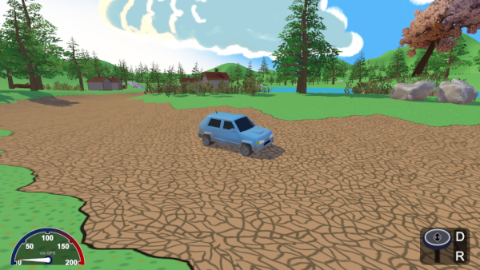
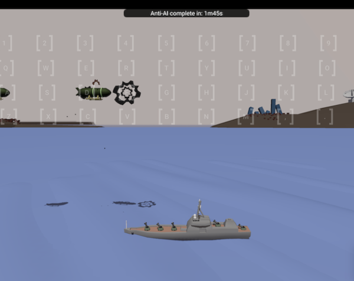
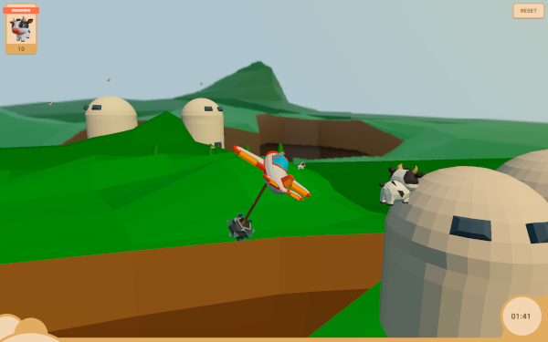

# Examples

Games and apps built with Lacking:

## Rally MKA

Drive around in a car with no particular purpose except to zone out.
Best played with keyboard or mouse. The gamepad option is hard.

> This game was the initial reason for the Lacking game engine.

## AI Suppression

A Game Jam entry. Defend your ship from alien airships using the keyboard — vim users will feel right at home.

> Solo 48h Sofia Game Jam (2023) entry.

## Dem Cows

Fly around in a plane and use a hanging club to pop cow balloons. The physics are semi-realistic, so stall and speed management matter. Best played with a gamepad — winning with a keyboard is very difficult.

> Duo 48h Hardcore Game Jam (2024) entry.
