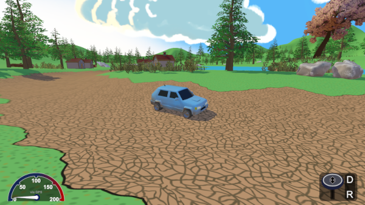
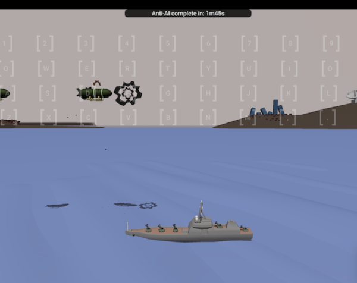
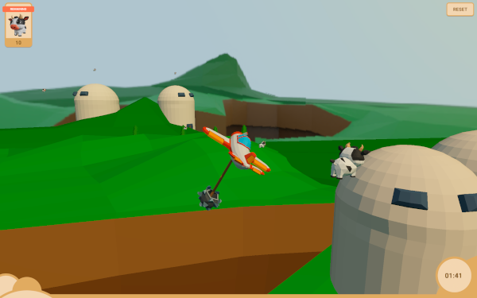

# Examples

Following are some example games and apps made with Lacking.

### Rally MKA

Drive around in a car with no particular purpose except to zone out.
Best played with keyboard or mouse. The gamepad option is hard.

> This game was the initial reason for the lacking game engine.

### AI Suppression

A Game Jam entry. Use the keyboard to defend your ship from alien airships. Users of vim will have an easy time here.

> A solo 48h Sofia Game Jam (2023) entry.

### Dem Cows

Fly around in a plane and use a hanging club to pop cow balloons. As it uses semi-realistic physics it is best played with a gamepad and care should be taken regarding stall and speed. There wasn't enough time to balance this game. Winning it with keyboard is nearly impossible.

> A duo 48h Hardcore Game Jam (2024) entry.
