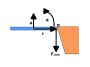

# Apparent Mass Derivation

Following is a derivation of the `apparent mass` as discussed in the physics [theory](../physics/theory.md#apparent-mass) section.

Let us consider an object that is experiencing both a linear acceleration $a$ and an angular acceleration $\alpha$ but has one of its sides attached to a stationary anchor point $p$. We would like to know what force the anchor point exerts on the object (and vice versa). Following is a depiction of the scenario.

We should consider the point $p$ on the object that is attached to the anchor. Since the anchor does not budge, we expect that point $p$ has to be stationary as well. Let's look at what accelerations point $p$ experiences.

The first acceleration it experiences is the one from the object's acceleration and angular acceleration.

$$
a_{object} = a + \alpha r
$$

The equation above is the one we already looked at in the [tangental acceleration](../physics/theory.md#tangental-acceleration) section.

The second acceleration it experiences is the one from the anchor, which is trying to resist the point's motion.

$$
a_{anchor} = -\frac{F_{anchor}}{m} - \frac{F_{anchor}r^2}{I}
$$

**Note:** The sign is negative, as the anchor acceleration acts in the opposite direction.

This second one is a bit more complicated. Let's look at how we arrived at the two terms. The first one represents the linear acceleration that the whole object would experience because of $F_{anchor}$ and the second one is the angular acceleration.

Recall from [offset force](../physics/theory.md#offset-force) that a force applied to an object induces both a force at the center of mass and a torque.

The linear acceleration is dervied as follows.

$$
F_{cm} = -F_{anchor}
$$

$$
\Downarrow
$$

$$
a_{cm} = \frac{F_{cm}}{m} = -\frac{F_{anchor}}{m}
$$

And the angular acceleration is derived as follows.

$$
\tau_{cm} = -F_{anchor} r
$$

$$
\Downarrow
$$

$$
\frac{\tau_{cm}}{I} = -\frac{F_{anchor} r}{I}
$$

$$
\Downarrow
$$

$$
\alpha = -\frac{F_{anchor} r}{I}
$$

$$
\Downarrow
$$

$$
\alpha r = -\frac{F_{anchor} r r}{I} = -\frac{F_{anchor} r^2}{I}
$$

$$
\Downarrow
$$

$$
a_{tangent} = -\frac{F_{anchor} r r}{I} = -\frac{F_{anchor} r^2}{I}
$$

Combining both the linear and angular accelerations, we get the following point acceleration due to the anchor force.

$$
a_{anchor} = a_{cm} + a_{tangent} = - \frac{F_{anchor}}{m} - \frac{F_{anchor}r^2}{I}
$$

---

If the point $p$ is to be stationary, we want the acceleration induced by the object to be negated by the acceleration induced by the anchor force.

$$
- a_{anchor} = a_{object}
$$

$$
\Downarrow
$$

$$
\frac{F_{anchor}}{m} + \frac{F_{anchor}r^2}{I} = a + \alpha r
$$

$$
\Downarrow
$$

$$
F_{anchor} (\frac{1}{m} + \frac{r^2}{I}) = (a + \alpha r)
$$

Which results in the following equation for the force being felt by the anchor point.

$$
F_{anchor} = (a + \alpha r) \frac{1}{\frac{1}{m} + \frac{r^2}{I}}
$$

---

If we consider the above to describe the Force as being induced by a single point, we could split it into the following segments.

$$
a_{apparent} = (a + \alpha r)
$$

$$
m_{apparent} = \frac{1}{\frac{1}{m} + \frac{r^2}{I}}
$$

Of course, this is mostly a thought experiment but the apparent mass can be useful, since it does simplify a lot of problem scenarios. Furthermore, it highlights that the anchor point does not experience the full weight of an object.
