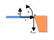

# Effective Mass Derivation

Following is a derivation of the `effective mass` as discussed in the physics [theory](../physics/theory.md#effective-mass) section.

Let us consider an object that is experiencing both a linear acceleration $a$ and an angular acceleration $\alpha$ but has one of its sides attached to a stationary anchor point $p$. We would like to know what force the anchor point exerts on the object (and vice versa). Following is a depiction of the scenario.

We should consider the point $p$ on the object that is attached to the anchor. Since the anchor does not budge, we expect that point $p$ has to be stationary as well. Let's look at what accelerations the point $p$ experiences.

The first acceleration it experiences is the one from the object's acceleration and angular acceleration.

$$
a_{object} = a + \alpha r
$$

The equation above is the one we already looked at in the [tangental acceleration](../physics/theory.md#tangental-acceleration) section.

The second acceleration it experiences is the one from the anchor, which is trying to resist the point's motion.

$$
a_{anchor} = -\frac{F_{anchor}}{m} - \frac{F_{anchor}r^2}{I}
$$

**Note:** The sign is negative, as the anchor acceleration acts in the opposite direction.

The second equation might be a bit more complicated. Let's look at how we arrived at the two terms. The first one represents the linear acceleration that the whole object would experience because of $F_{anchor}$ and the second one is the angular acceleration.

Recall from [offset force](../physics/theory.md#offset-force) that a force applied to an object induces both a force at the center of mass and a torque.

The linear acceleration is dervied as follows.

$$
F_{cm} = -F_{anchor}
$$

$$
\Downarrow
$$

$$
a_{cm} = \frac{F_{cm}}{m} = -\frac{F_{anchor}}{m}
$$

And the angular acceleration is derived as follows.

$$
\tau_{cm} = -F_{anchor} r
$$

$$
\Downarrow
$$

$$
\frac{\tau_{cm}}{I} = -\frac{F_{anchor} r}{I}
$$

$$
\Downarrow
$$

$$
\alpha = -\frac{F_{anchor} r}{I}
$$

$$
\Downarrow
$$

$$
\alpha r = -\frac{F_{anchor} r r}{I} = -\frac{F_{anchor} r^2}{I}
$$

$$
\Downarrow
$$

$$
a_{tangent} = -\frac{F_{anchor} r r}{I} = -\frac{F_{anchor} r^2}{I}
$$

Combining both the linear and angular accelerations, we get the following point acceleration due to the anchor force.

$$
a_{anchor} = a_{cm} + a_{tangent} = - \frac{F_{anchor}}{m} - \frac{F_{anchor}r^2}{I}
$$

---

If the point $p$ is to be stationary, we want the acceleration induced by the object to be negated by the acceleration induced by the anchor force.

$$
- a_{anchor} = a_{object}
$$

$$
\Downarrow
$$

$$
\frac{F_{anchor}}{m} + \frac{F_{anchor}r^2}{I} = a + \alpha r
$$

$$
\Downarrow
$$

$$
F_{anchor} (\frac{1}{m} + \frac{r^2}{I}) = (a + \alpha r)
$$

Which results in the following equation for the force being felt by the anchor point.

$$
F_{anchor} = (a + \alpha r) \frac{1}{\frac{1}{m} + \frac{r^2}{I}}
$$

---

If we consider the above to describe the Force as being induced by a single point, we could split it into the following segments.

$$
a_{eff} = (a + \alpha r)
$$

$$
m_{eff} = \frac{1}{\frac{1}{m} + \frac{r^2}{I}}
$$

The way you can think of the effective mass is that it represents the [inertial mass](https://en.wikipedia.org/wiki/Mass#Inertial_mass) of the object at that particular offset point (i.e. how much would it resist motion if a force were applied at that particular position).

Of course, this is mostly a thought experiment but the effective mass can be useful, since it does simplify a lot of problem scenarios. Furthermore, it highlights that the anchor point does not experience the full weight of an object.

## Effective Mass in Practice

The equation we derived above makes some assumptions. It looks at an idealized scenario where the force is perpendicular to the radius, meaning it applies maximum torque. In reality, the forces we deal with can have arbitrary directions. Furthermore, we looked at a 2D scenario, whereas a 3D one is a bit more intricate due to the moment of inertia.

If we rework the above equation for 3D, we get to the following equation.

$$
m_{eff} = \frac{1}{m^{-1} + I^{-1}(\vec{r} \times \hat{n})^2}
$$

**Note** that while $m^{-1}$ is just $\frac{1}{m}$, the $I^{-1}$ term is actually the inverse matrix of the inertia tensor. Furthermore, despite $(\vec{r} \times \hat{n})$ being squared for brevity, it is not possible to do that multiplication first, since these are two column vectors. Instead, that term needs to be multiplied two times to the inverse inertia tensor matrix, which will yield a scalar value.

**Note** also, that $(\vec{r} \times \hat{n})$ produces a vector in the direction of rotation, which is the correct way to multiply by the inertia tensor.

Lastly, in practice, most algorithms in the physics engine actually need the inverse effective mass $m_{eff}^{-1}$, which is actually easier to write.

$$
m_{eff}^{-1} = m^{-1} + I^{-1}(\vec{r} \times \hat{n})^2
$$

In fact, having it written in this form will make some other equations to follow nicer as well.

## Reduced Effective Mass

When dealing with two objects that are tied together or are experiencing a collision, the correction impulses we need to apply to the objects (actually the same impulse with two opposite directions) need to take the two masses into consideration.

In such cases the combined ([reduced mass](https://en.wikipedia.org/wiki/Reduced_mass)) can be calculated as follows.

$$
m_{red} = \frac{1}{m_{1eff}^{-1} + m_{2eff}^{-1}}
$$

As with the individual effective masses, here too we prefer using the inverse of the reduced mass, which has a more simplified form, as follows.

$$
m_{red}^{-1} = m_{1eff}^{-1} + m_{2eff}^{-1}
$$

or

$$
\frac{1}{m_{red}} = \frac{1}{m_{1eff}} + \frac{1}{m_{2eff}}
$$

The derivation is based on the equations for [momentum](https://en.wikipedia.org/wiki/Momentum) and preservation of momentum on collision.

### Inelastic collision

In the case where we have the two objects tied together (e.g. a hinged rod constraint), we can think of them experiencing constant inelastic collisions.

$$
m_1 u_1 + m_2 u_2 = (m_1 + m_2) v
$$

From the point of view of $v$ this equation can also be expressed as:

$$
v = \frac{m_1 u_1 + m_2 u_2}{m_1 + m_2}
$$

Here $m_1$ and $m_2$ are the effective masses of the two objects, $u_1$ and $u_2$ are their initial (pre-collision) velocities respectively, and $v$ is the final velocity (post-collision) that they will both share.

The change in velocity for the first object can be expressed as follows.

$$
\Delta v_1 = v - u_1 
$$

The impulse that will provide such a change in velocity has the following equation.

$$
P_1 = \Delta v m_1 = (v - u_1) m_1
$$

Plugging in the equation for $v$ from above, we get the following equation.

$$
P_1 = (\frac{m_1 u_1 + m_2 u_2}{m_1 + m_2} - u_1) m_1
$$

$$
\Downarrow
$$

$$
P_1 = (\frac{m_1 u_1 + m_2 u_2 - m_1 u_1 - m_2 u_1}{m_1 + m_2}) m_1
$$

$$
\Downarrow
$$

$$
P_1 = (\frac{m_2 u_2 - m_2 u_1}{m_1 + m_2}) m_1
$$

$$
\Downarrow
$$

$$
P_1 = (u_2 - u_1) \frac{m_1 m_2}{m_1 + m_2}
$$

Lastly, we can do the following transformation on the mass-related part of the equation.

$$
\frac{m_1 m_2}{m_1 + m_2} =
\frac{1}{\frac{m_1 + m_2}{m_1 m_2}} = 
\frac{1}{\frac{m_1}{m_1 m_2} + \frac{m_2}{m_1 m_2}} =
\frac{1}{\frac{1}{m_2} + \frac{1}{m_1}}
$$

Hence, we have the following.

$$
m_{red} = \frac{1}{\frac{1}{m_2} + \frac{1}{m_1}}
$$

And with one last transformation, we have the desired equation.

$$
\frac{1}{m_{red}} = \frac{1}{m_2} + \frac{1}{m_1}
$$

### Elastic collision

The equation for elastic collision is as follows.

$$
v_1 = \frac{(m_1 - m_2)}{(m_1 + m_2)} u_1 + \frac{2 m_2}{(m_1 + m_2)} u_2
$$

We follow the same approach as with the inelastic collision by expressing the change of velocity of one of the objects through an impulse.

$$
P_1 = \left[ \frac{(m_1 - m_2)}{(m_1 + m_2)} u_1 + \frac{2 m_2}{(m_1 + m_2)} u_2 - u_1 \right] m_1
$$

$$
\Downarrow
$$

$$
P_1 = \left[ \frac{(m_1 u_1 - m_2 u_1)}{(m_1 + m_2)} + \frac{2 m_2 u_2}{(m_1 + m_2)} - \frac{m_1 u_1 + m_2 u_1}{(m_1 + m_2)} \right] m_1
$$

$$
\Downarrow
$$

$$
P_1 = \left[ \frac{m_1 u_1 - m_2 u_1 + 2 m_2 u_2 - m_1 u_1 - m_2 u_1}{m_1 + m_2} \right] m_1
$$

$$
\Downarrow
$$

$$
P_1 = \left[ \frac{2 m_2 u_2 - 2 m_2 u_1}{m_1 + m_2} \right] m_1
$$

$$
\Downarrow
$$

$$
P_1 = 2(u_2 - u_1) \frac{m_1 m_2}{m_1 + m_2}
$$

Once again, the mass-related part of the equation is the same, hence proving our derivation of the reduced mass.

**Note** that the constant $2$ in the equation is not part of the mass. It has to do with the type of collision and is related to the [coefficient of restitution](https://en.wikipedia.org/wiki/Coefficient_of_restitution).

The actual equation, and in fact a more general equation for both types of collisions, is as follows.

$$
P_1 = (1 + e) (u_2 - u_1) \frac{m_1 m_2}{m_1 + m_2}
$$

The $e$ term is a scalar ranging from $0$ to $1$ and represents how elastic a collision is.

One last thing to mention is that the impulse acting on the other object is the same, except that it has the opposite direction - we have $(u_1 - u_2)$.
