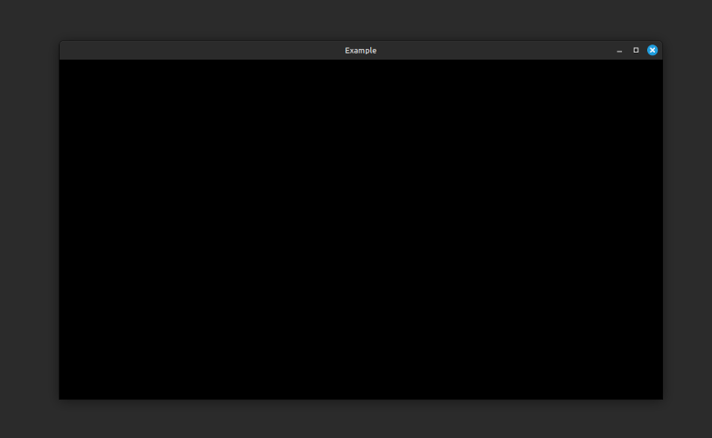

# Application

The Lacking game engine provides a lightweight API for managing an application window. In many regards, it is similar to what GLFW or SDL2 provide. The benefits are that it is a more Go-oriented and simplified API that is abstract enough to support Web builds as well. The downside is that it does not include all of the advanced features that the aforementioned libraries provide.

The API is described in the [api](https://pkg.go.dev/github.com/mokiat/lacking/app) package of the library. This package only includes an interface. To actually instantiate a working window, one must use one of the two available implementations:

- The similarly named [app](https://pkg.go.dev/github.com/mokiat/lacking-native/app) package in [lacking-native](https://github.com/mokiat/lacking-native) provides a Desktop implementation (at the time of writing based on GLFW).
- The similarly named [app](https://pkg.go.dev/github.com/mokiat/lacking-js/app) package in [lacking-js](https://github.com/mokiat/lacking-js) provides a Web implementation.

> By having an abstract API, the underlying implementation can be swapped. There were successful ports to SDL2, but due to complexities in building `.so` and `.dll` files, it was rolled back in favour of GLFW.

At its core, a developer needs only to implement the `Controller` interface in order to receive keyboard, mouse, and gamepad events and make changes to the window object itself.

The following is a minimal example for starting an app:

```go
package main

import (
	nativeapp "github.com/mokiat/lacking-native/app"
	"github.com/mokiat/lacking/app"
)

func main() {
	if err := runApplication(); err != nil {
		panic(err)
	}
}

func runApplication() error {
	cfg := nativeapp.NewConfig("Example", 1024, 576)
	return nativeapp.Run(cfg, &CustomController{})
}

type CustomController struct {
	app.NopController
}
```

The `CustomController` above is the implementation of the `Controller` interface. It composes the `app.NopController` type, which provides no-op implementations for all methods of the interface. This allows one to override only the relevant methods.



In a typical project, the built-in `game.Controller` and `ui.Controller` implementations would be used instead, with developers interacting through higher-level APIs.
