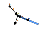
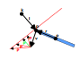

# Impulse Derivation

This page dives into a bit more details as to how we get to the impulse equation.

## Single-body Constraint

Let's consider a point $p$ of an object. The point need not necessarily be the center of mass of the object. Let us also imagine that we have a positional constraint $C_p$ for that point.

Following is an example of a constraint that ensures that point $p$ is at distance $l$ from some world coordinate $k$.

$$
C_p(p) = |\vec{p} - \vec{k}| - l
$$

This can be depicted as follows.

We get the velocity constraint by differentiating over time.

$$
C_v(v) = C_p' =
\frac{(\vec{p} - \vec{k})}{|\vec{p} - \vec{k}|} \cdot p' =
\frac{(\vec{p} - \vec{k})}{|\vec{p} - \vec{k}|} \cdot \vec{v}
$$

For simplicity, let us track the position difference between point $p$ and $k$ as $\vec{d}$. We get the following.

$$
C_v(v) = \hat{d} \cdot \vec{v}
$$

The velocity $v$ of point $p$ is actually the combination of the linear and angular velocities of the object, as follows.

$$
\vec{v} = \vec{v_o} + \vec{w_o} \times \vec{r}
$$

Here $\vec{r}$ denotes $(\vec{p} - \vec{o})$, where $o$ is the center of mass of the object.

Next we calculate the (single-row) Jacobian matrix $J$ by differentiating over each individual velocity component (including the angular velocity components).

$$
J^T =
\begin{bmatrix}
\hat{d}_x \\
\hat{d}_y \\
\hat{d}_z \\
(\vec{r} \times \hat{d})_x \\
(\vec{r} \times \hat{d})_y \\
(\vec{r} \times \hat{d})_z \\
\end{bmatrix}
$$

**Note:** For the angular velocity components we use the triple product rule, which transforms $\hat{d} \cdot (\vec{w_o} \times \vec{r})$ into $\vec{w} \cdot (\vec{r} \times \hat{d})$, making it much easier to differentiate.

Now that we have the jacobian, we can determine how much the object's linear and angular velocities violate the constraint by multiplying them.

$$
c_{err} = J V_{obj}
$$

Note that $V_{obj}$ here represents a vector containing both linear and angular velocity components.

What we want to do is to apply an impulse $P$ such that the constraint error of the new velocity is zero. There are a number of impulse vectors that can adjust the object's velocity, and in response the point's velocity, such that the constraint is satisfied.

**Note:** The `P` vectors on the diagram don't represent the actual impulses but rather the outcome on the point's velocity. The actual impulses are applied to the object's center in the form of both linear and angular velocity changes, however, it would be hard to visualize them in a meaningful way on the diagram.

We need to pick such a combination of linear and angular velocity changes such that energy is not introduced in the system, though losing some energy is acceptable. We do this by performing a gradient descent using the Jacobian (which is just a transposed gradient).

$$
P = J^T \lambda
$$

Here $\lambda$ is the impulse strength that we next need to derive. Also, the $P$ vector includes both the linear and angular components (i.e. is 6-dimensional) and the angular velocity components are already scaled by the necessary radius amount and effective mass, same as the linear velocity components.

Thus, the change in velocity of the object can be expressed as follows.

$$
\Delta V = M^{-1} P
$$

$$
\Downarrow
$$

$$
\Delta V = M^{-1} J^T \lambda
$$

As mentioned above, we want the new velocity to have zero constraint error.

$$
c_{err} = J V_{new} = 0
$$

Knowing that $V_{new} = V + \Delta V$, we can express it as follows.

$$
c_{err} = J (V + \Delta V) = 0
$$

Replacing $\Delta V$ with the above equation, we get the following expression.

$$
J (V + M^{-1} J^T \lambda) = 0
$$

$$
\Downarrow
$$

$$
J V + J M^{-1} J^T \lambda = 0
$$

$$
\Downarrow
$$

$$
J M^{-1} J^T \lambda = - J V
$$

$$
\Downarrow
$$

$$
\lambda = - \frac{J V}{J M^{-1} J^T}
$$

Once we plug $\lambda$ into the impulse equation, we get the final form.

$$
P = - J^T \frac{J V}{J M^{-1} J^T}
$$

---

If we were to substitute the Jacobian arguments with the example ones from above, we will realize that $J M^{-1} J^T$ actually produces $m_{eff}^{-1}$ and $JV$ equals $C_v(V)$, leading to the following.

$$
P = - J^T \left[ C_v(V) m_{eff} \right]
$$

In reality, however, the above equation is more useful, since we only need to calculate the inverse mass and the jacobian once and we have all that is needed to resolve the constraint.

## Double-body Constraint

Solving double-body constraints is fairly similar, except that the Jacobian is now 12-dimensional, since it contains the linear and angular components of both objects.

## Inequality Constraints

Some constraints are applicable only half-way, for example a collision between an object and a surface. We want to apply the constraint only if it is unsatisfied at one end (either positive or negative - up to the reader).

$$
C_p(P) >= 0
$$

$$
\Downarrow
$$

$$
C_v(V) >= 0
$$

From an implementation point of view, it is possible to just check it and not apply any impulses if positive. However, there is also the aspect of bounciness. So far, we have been adjusting the velocities in such a way as to remove the excess velocity in a certain direction. With inequality constraints the desired outcome could be that the object bounce back with the same or similar velocity.

We can do this by applying up to twice the correction impulse and can control this using the [coefficient of restitution](https://en.wikipedia.org/wiki/Coefficient_of_restitution).

$$
\lambda = - (1 + e) \frac{J V}{J M^{-1} J^T}
$$

Here $e$ usually ranges from $0$ to $1$ in value. A value of $0$ indicates an inelastic collision whereas a value of $1$ indicates a fully elastic collision.

Specifying a negative value is meaningless and specifying a value bigger than $1$ would introduce energy into the system, which might be desired in some special circumstances (e.g. a jump platform).

*Side note:* It is possible to reuse the same equation for equality constraints as well, one just needs to treat them as inelastic and always specify $e = 0$.
